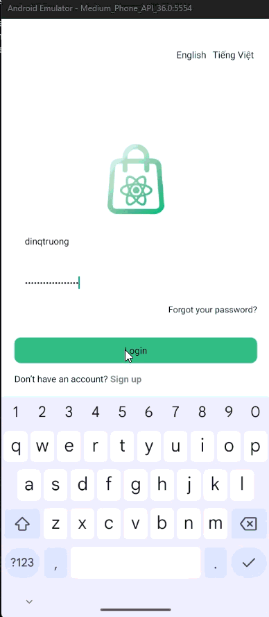
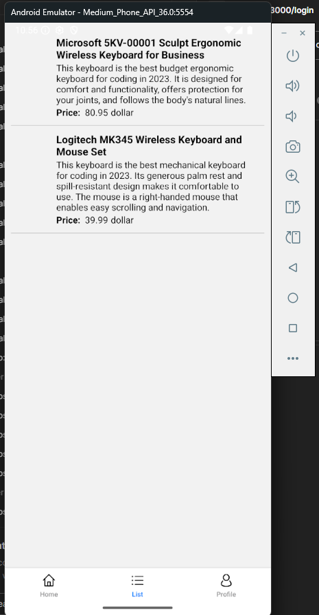
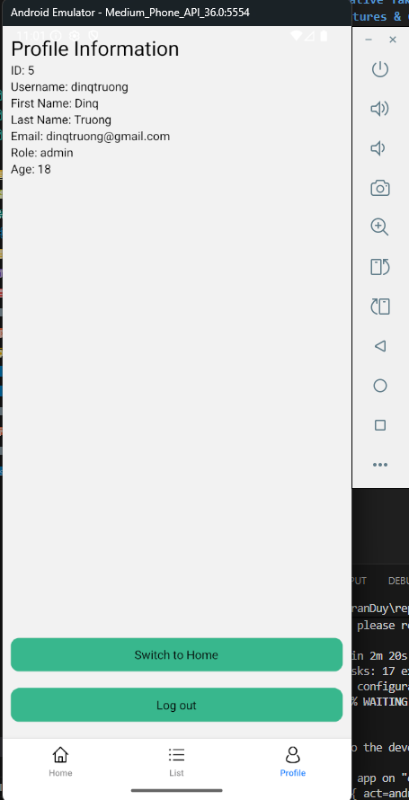

# React Native Take-Home Assignment

## 📱 Overview
This project is a React Native mobile application built as part of a take-home assignment.  
The app demonstrates common real-world mobile development requirements such as authentication, secure storage, API integration, navigation, and local persistence.

The main goal is to showcase **clean architecture**, **practical React Native patterns**, and **production-ready features**.

---

## 🛠 Tech Stack
- **React Native**
- **TypeScript**
- **React Navigation**
- **Axios / Fetch API**
- **Encrypted Storage**
- **Local Database** (as required)
- **State Management** (Redux / Context API – adjust if needed)

---

## 🚀 Features & Challenges Completed

### 1️⃣ Integrate with Login API ✅
- Implemented login flow using a remote authentication API
- Handles loading, success, and error states
- Validates API response and extracts authentication token

📸 **Screenshot**



🧩 **Code Snippet**
```ts
const login = async (username: string, password: string) => {
    try {
      const res = await apiService.login(username, password);
      const newToken = res.data.data.token;
      await tokenStorage.set(newToken);

      const profile = await fetchProfileWithToken(newToken);
      console.log('profile', profile);
      setUser(profile);
    } catch (err: any) {
      const message = err?.response?.data?.error?.message ?? 'Login failed';

      console.log(message);
    }
};
```

### 2️⃣ Secure Token Storage using Encrypted Storage ✅
- Securely stores authentication token after successful login
- Prevents token exposure via AsyncStorage or plain text
- Token is retrieved securely for authenticated API calls

📸 **Screenshot**


🧩 **Code Snippet**
```ts
import EncryptedStorage from "react-native-encrypted-storage";

const TOKEN_KEY = "auth_token";

export const tokenStorage = {
  get: async (): Promise<string | null> => {
    return EncryptedStorage.getItem(TOKEN_KEY);
  },
  set: async (token: string): Promise<void> => {
    await EncryptedStorage.setItem(TOKEN_KEY, token);
  },
  clear: async (): Promise<void> => {
    await EncryptedStorage.removeItem(TOKEN_KEY);
  },
};
```

### 3️⃣ Display Product List on Home Tab Navigation ✅
- Uses Tab Navigation
- Fetches product list from API
- Displays products in a performant list (FlatList)
- Handles loading and empty states

📸 Screenshot



### 4. Profile Screen – Fetch User Profile from API ✅
- Dedicated Profile screen
- Fetches user profile from backend API
- Displays user information in a structured layout

📸 Screenshot



### 5. Save User Profile to Local Database ✅
- Saves user profile data to the provided local database
- Enables offline access to profile information
- Syncs API response with local storage

🧩 **Code Snippet**
```ts
import SQLite from "react-native-sqlite-storage";

SQLite.enablePromise(true);

const DB_NAME = "app.db";

let dbPromise: Promise<SQLite.SQLiteDatabase> | null = null;

async function getDb() {
  if (!dbPromise) {
    dbPromise = SQLite.openDatabase({ name: DB_NAME, location: "default" });
  }
  return dbPromise;
}

export async function initUserTable() {
  const db = await getDb();
  await db.executeSql(`
    CREATE TABLE IF NOT EXISTS user_profile (
      id INTEGER PRIMARY KEY NOT NULL,
      username TEXT NOT NULL,
      email TEXT,
      firstName TEXT,
      lastName TEXT,
      role TEXT,
      age INTEGER,
      password TEXT,
      updatedAt INTEGER NOT NULL
    );
  `);
}

export type DbUser = {
  id: number;
  username: string;
  email?: string | null;
  firstName?: string | null;
  lastName?: string | null;
  role?: string | null;
  age?: number | null;
  password?: string | null;
};

export async function saveUserProfile(user: DbUser) {
  const db = await getDb();
  const now = Date.now();

  await db.executeSql(
    `
    INSERT OR REPLACE INTO user_profile
      (id, username, email, firstName, lastName, role, age, password, updatedAt)
    VALUES (?, ?, ?, ?, ?, ?, ?, ?, ?);
    `,
    [
      user.id,
      user.username,
      user.email ?? null,
      user.firstName ?? null,
      user.lastName ?? null,
      user.role ?? null,
      user.age ?? null,
      user.password ?? null,
      now,
    ]
  );
}

export async function getUserProfile(id: number) {
  const db = await getDb();
  const [result] = await db.executeSql(
    `SELECT * FROM user_profile WHERE id = ? LIMIT 1;`,
    [id]
  );

  if (result.rows.length === 0) return null;
  return result.rows.item(0);
}
```

## 🧭 Application Flow
1. User logs in via Login Screen
2. Authentication token is securely stored
3. User is redirected to Home (Tab Navigation)
4. Product list is displayed
5. User profile is fetched from API
6. Profile data is saved and read from local database

## ▶️ Running the Project

```bash
npm install
# or
yarn install

npm run android
# or
npm run ios
```
